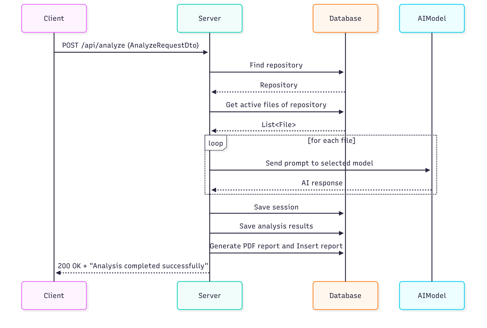

# GitHub Code Analyzer

Spring Boot + React kullanılarak geliştirilmiş bir statik kod analiz uygulamasıdır. Kullanıcıdan alınan GitHub reposunu analiz eder, sonuçları veri tabanına kaydeder ve PDF olarak raporlar.

---

## 📁 Proje Yapısı

```
Github/
├── backend/             # Spring Boot uygulaması
│   └── githubfiles/     # Ana Java backend kodları
├── frontend/            # React + Vite tabanlı kullanıcı arayüzü
```

---

## ⚙️ Backend (Spring Boot)

### 📁 Modüller

- `githubfiles`: Ana Spring Boot uygulaması

### 

`application.properties` örneği:

```properties
spring.application.name=githubfiles

# Database
spring.datasource.url=jdbc:postgresql://localhost:5432/code_analyzer_db
spring.datasource.username=${DB_USERNAME}
spring.datasource.password=${DB_PASSWORD}
spring.jpa.hibernate.ddl-auto=update
spring.jpa.show-sql=true
spring.jpa.properties.hibernate.dialect=org.hibernate.dialect.PostgreSQLDialect
spring.jpa.properties.hibernate.jdbc.lob.non_contextual_creation=true

# AI varsayılan sağlayıcı ve model
ai.default.provider=ollama
ai.default.model=gemma3:4b

# OpenAI Ayarları
spring.ai.openai.api-key=${OPENAI_API_KEY}
#spring.ai.openai.chat.model=gpt-4o
spring.ai.openai.chat.temperature=0.2
spring.ai.openai.chat.top-p=1.0
spring.ai.openai.chat.timeout=60s

# Ollama Ayarları
spring.ai.ollama.base-url=http://localhost:11434
#spring.ai.ollama.chat.options.model=gemma3:4b
spring.ai.ollama.chat.options.temperature=0.2
spring.ai.ollama.chat.options.top-p=1.0
spring.ai.ollama.chat.timeout=60s

# JWT
jwt.secret=${JWT_SECRET}

### 🧠 Yapay Zeka Desteği

Uygulama, yerel çalışan modellerle (Ollama) veya OpenAI API ile analiz gerçekleştirebilir.

---

## 💻 Frontend (React)

- Vite + React ile geliştirilmiştir
- REST API üzerinden backend ile haberleşir
- Kullanıcı analiz başlatabilir ve sonuçları PDF olarak indirebilir

### Kurulum:

```bash
cd frontend
npm install
npm run dev
```

---

## 🚀 Projeyi Çalıştırma

### Backend:

```bash
cd backend/githubfiles
./mvnw spring-boot:run
```

### Frontend:

```bash
cd frontend
npm run dev
```

---

## 🔐 Login Akışı


---

## 🔁 Access Token Yenileme Akışı


---

## 📊 Analyze API İşleyişi

