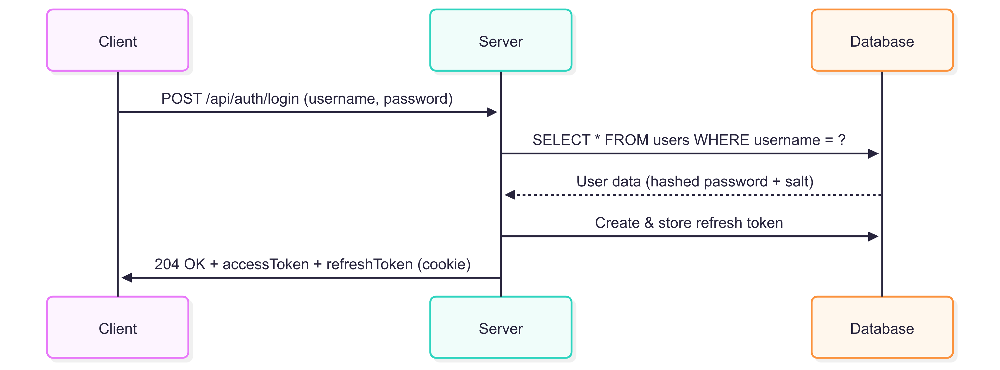
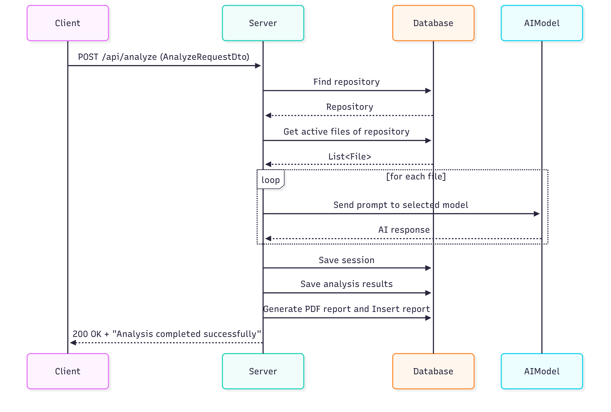
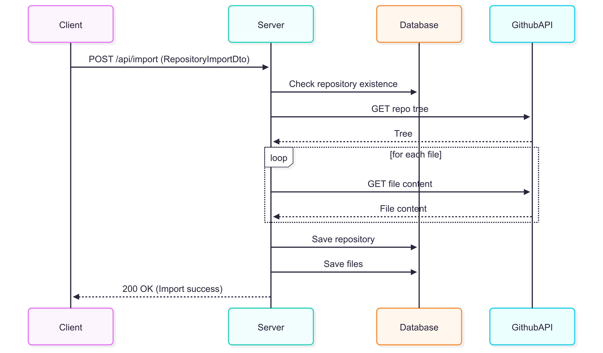
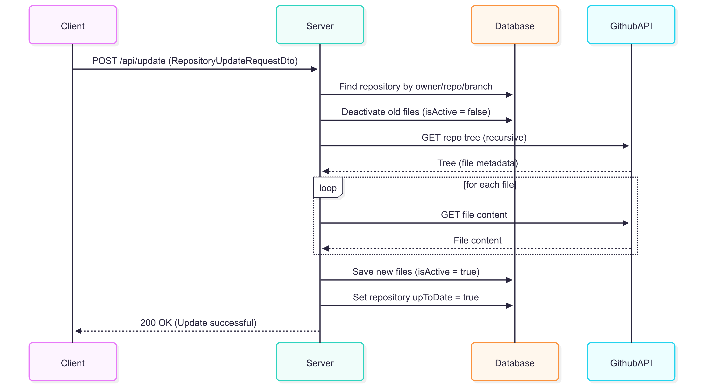
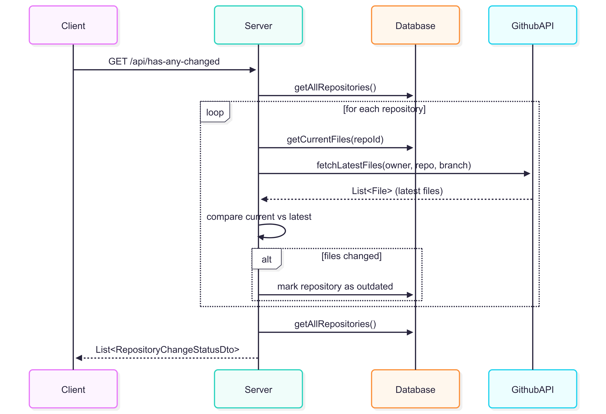
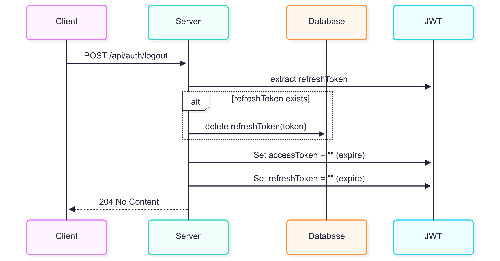

# GitHub Code Analyzer

Spring Boot + React kullanılarak geliştirilmiş bir statik kod analiz uygulamasıdır. Kullanıcıdan alınan GitHub reposunu analiz eder, sonuçları veri tabanına kaydeder ve PDF olarak raporlar.

---

## 🧰 Kullanılan Teknolojiler


---

---

## 📁 Proje Yapısı

```
Github/
├── backend/             # Spring Boot uygulaması
│   └── githubfiles/     # Ana Java backend kodları
├── frontend/            # React + Vite tabanlı kullanıcı arayüzü
```

---

## ⚙️ Backend (Spring Boot)

### 📁 Modüller

- `githubfiles`: Ana Spring Boot uygulaması

### 

`application.properties` örneği:

```properties
spring.application.name=githubfiles

# Database
spring.datasource.url=jdbc:postgresql://localhost:5432/code_analyzer_db
spring.datasource.username=${DB_USERNAME}
spring.datasource.password=${DB_PASSWORD}
spring.jpa.hibernate.ddl-auto=update
spring.jpa.show-sql=true
spring.jpa.properties.hibernate.dialect=org.hibernate.dialect.PostgreSQLDialect
spring.jpa.properties.hibernate.jdbc.lob.non_contextual_creation=true

# AI varsayılan sağlayıcı ve model
ai.default.provider=ollama
ai.default.model=gemma3:4b

# OpenAI Ayarları
spring.ai.openai.api-key=${OPENAI_API_KEY}
#spring.ai.openai.chat.model=gpt-4o
spring.ai.openai.chat.temperature=0.2
spring.ai.openai.chat.top-p=1.0
spring.ai.openai.chat.timeout=60s

# Ollama Ayarları
spring.ai.ollama.base-url=http://localhost:11434
#spring.ai.ollama.chat.options.model=gemma3:4b
spring.ai.ollama.chat.options.temperature=0.2
spring.ai.ollama.chat.options.top-p=1.0
spring.ai.ollama.chat.timeout=60s

# JWT
jwt.secret=${JWT_SECRET}

### 🧠 Yapay Zeka Desteği

Uygulama, yerel çalışan modellerle (Ollama) veya OpenAI API ile analiz gerçekleştirebilir.

---

## 💻 Frontend (React)

- Vite + React ile geliştirilmiştir
- REST API üzerinden backend ile haberleşir
- Kullanıcı analiz başlatabilir ve sonuçları PDF olarak indirebilir

### Kurulum:

```bash
cd frontend
npm install
npm run dev
```

---

## 🚀 Projeyi Çalıştırma

Uygulama Docker Compose ile tek komutla ayağa kaldırılabilir. PostgreSQL, Spring Boot (backend), Ollama ve React (frontend) container olarak başlatılır.

---

### 1. Ortam Değişkenlerini Ayarla

📝 Proje kök dizininde aşağıdaki komutla `.env` dosyasını oluştur:

```bash
cp .env.example .env

✍️ Daha sonra .env dosyasındaki değişkenleri kendi bilgilerine göre doldur:

DB_USERNAME=postgres
DB_PASSWORD=postgres
JWT_SECRET=your-secret-key
OPENAI_API_KEY=your-openai-key
GITHUB_TOKEN=your-github-token
```

---

### 2.🐳 Docker Compose ile Başlat:

Projenin kök dizininde:

```bash
docker-compose up --build
```

---

### 3. Servislere Erişim

| Servis         | URL                          |
|----------------|------------------------------|
| Backend API    | http://localhost:8080        |
| Frontend UI    | http://localhost:5173        |
| Ollama (LLM)   | http://localhost:11434       |
| PostgreSQL     | localhost:5432 (iç bağlantı) |

---

### 4. Temiz Başlatmak İstersen

Her şeyi sıfırlayıp yeniden başlatmak için:

```bash
docker-compose down -v
docker-compose up --build
```
---

## 🔐 Login Akışı



---

## 🔁 Access Token Yenileme Akışı


---

## 📊 Analyze API İşleyişi



---

## 📥 Repository Import Akışı



---

## 🔄 Repository Update Akışı



---

## 📦 Repository Değişiklik Kontrolü



---

## 🔓 Logout Akışı



---