# GitHub Code Analyzer

Spring Boot + React kullanılarak geliştirilmiş bir statik kod analiz uygulamasıdır. Kullanıcıdan alınan GitHub reposunu analiz eder, sonuçları veri tabanına kaydeder ve PDF olarak raporlar.

---

## 🧰 Kullanılan Teknolojiler


---

---

## 🖼️ Uygulama Ekran Görüntüleri

### 🔐 Giriş Ekranı
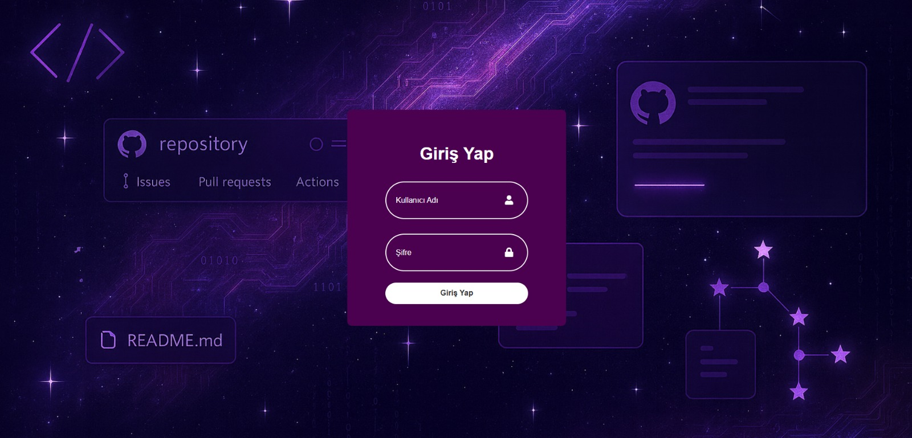

### 🧠 Ana Sayfa
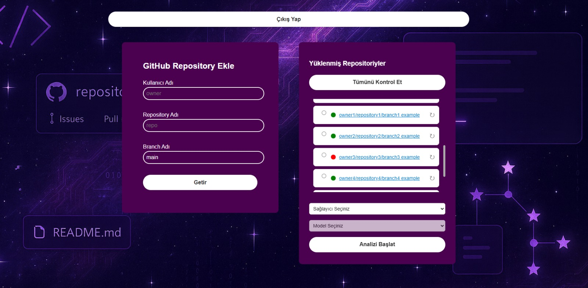

`Kullanıcı burada GitHub reposunu girerek analiz başlatabilir.`

### 📋 Rapor Listesi
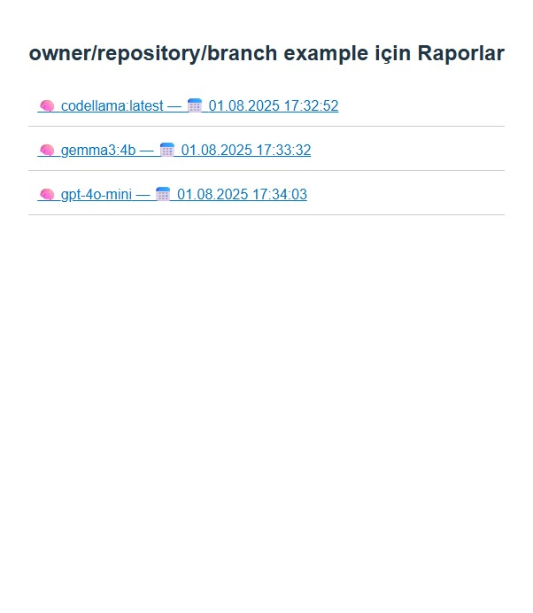

`Geçmiş analiz raporlarının listelendiği ekran.`

### 📄 Örnek Rapor
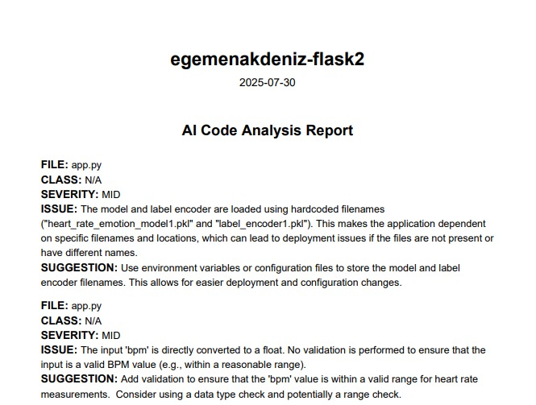

`Yapay zeka tarafından oluşturulmuş örnek bir PDF analiz raporu önizlemesi.`  
`Kullanıcı raporu cihazına indirebilir veya görüntüleyebilir.`

📄 [Örnek Rapor PDF](docs/gemma.pdf)  
`Gemma tarafından oluşturulan örnek raporun PDF versiyonu.`
---

---

## 📁 Proje Yapısı

```
Github/
├── backend/             # Spring Boot uygulaması
│   └── githubfiles/     # Ana Java backend kodları
├── frontend/            # React + Vite tabanlı kullanıcı arayüzü
```

---

## ⚙️ Backend (Spring Boot)

- ✅ Spring Boot 3.4.7 ile geliştirilmiştir.
- 🔐 Spring Security kullanılarak JWT tabanlı kimlik doğrulama uygulanmıştır.
- 🗄️ Spring Data JPA + PostgreSQL veritabanı yönetimi sağlar.
- 🧠 Yapay zeka analizleri için Spring AI ile OpenAI ve Ollama entegre edilmiştir.
- 📄 OpenPDF kullanılarak analiz sonuçları PDF formatında raporlanır.
- 🔗 Frontend ile REST API mimarisi üzerinden iletişim kurar.
- 📘 Springdoc (OpenAPI) ile Swagger UI desteği mevcuttur.
- 🧹 Global Exception Handler sayesinde tüm hatalar standart formatta yönetilir.

### 📁 Modüller

- `githubfiles`: Ana Spring Boot uygulaması

### 

`application.yml` örneği::

```yml

spring:
  application:
    name: githubfiles

  datasource:
    url: jdbc:postgresql://postgres:5432/code_analyzer_db
    username: ${DB_USERNAME}
    password: ${DB_PASSWORD}

  jpa:
    hibernate:
      ddl-auto: update
    show-sql: true
    properties:
      hibernate:
        dialect: org.hibernate.dialect.PostgreSQLDialect
        jdbc:
          lob:
            non_contextual_creation: true

  sql:
    init:
      mode: always

  ai:
    openai:
      api-key: ${OPENAI_API_KEY}
      chat:
        temperature: 0.2
        top-p: 1.0
        timeout: 60s
    ollama:
      base-url: http://ollama:11434
      chat:
        options:
          temperature: 0.2
          top-p: 1.0
        timeout: 60s

ai:
  default:
    provider: ollama
    model: gemma3:4b

jwt:
  secret: ${JWT_SECRET}
```

---

### 🧠 Yapay Zeka Desteği

Uygulama, yerel çalışan modellerle (Ollama) veya OpenAI API ile analiz gerçekleştirebilir.

---

## 💻 Frontend (React)

- Vite + React ile geliştirilmiştir
- REST API üzerinden backend ile haberleşir
- Kullanıcı analiz başlatabilir ve sonuçları PDF olarak indirebilir


---

## 🗄️ Veritabanı Diyagramı

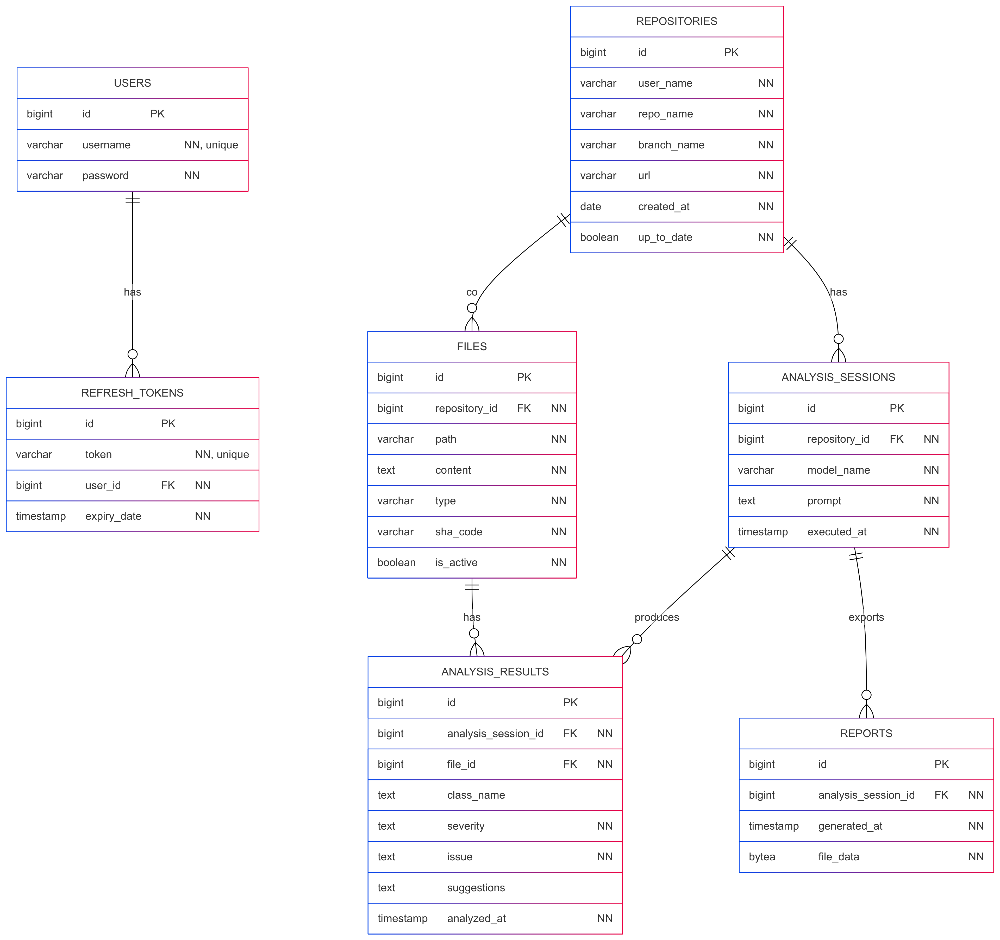  
Uygulamanın kullandığı PostgreSQL şema diyagramı.

---

## 🚀 Projeyi Çalıştırma

Uygulama Docker Compose ile tek komutla ayağa kaldırılabilir. PostgreSQL, Spring Boot (backend), Ollama ve React (frontend) container olarak başlatılır.

---

### 1. Ortam Değişkenlerini Ayarla

📝 Proje kök dizininde aşağıdaki komutla `.env` dosyasını oluştur:

```bash
cp .env.example .env

✍️ Daha sonra .env dosyasındaki değişkenleri kendi bilgilerine göre doldur:

DB_USERNAME=postgres
DB_PASSWORD=postgres
JWT_SECRET=your-secret-key
OPENAI_API_KEY=your-openai-key
GITHUB_TOKEN=your-github-token
```

### 2.🐳 Docker Compose ile Başlat:

Projenin kök dizininde:

```bash
docker-compose up --build
```

### 3. Servislere Erişim

| Servis         | URL                          |
|----------------|------------------------------|
| Backend API    | http://localhost:8080        |
| Frontend UI    | http://localhost:5173        |
| Ollama (LLM)   | http://localhost:11434       |
| PostgreSQL     | localhost:5432 (iç bağlantı) |

### 4. Temiz Başlatmak İstersen

Her şeyi sıfırlayıp yeniden başlatmak için:

```bash
docker-compose down -v
docker-compose up --build
```
---

## 🔐 Login Akışı

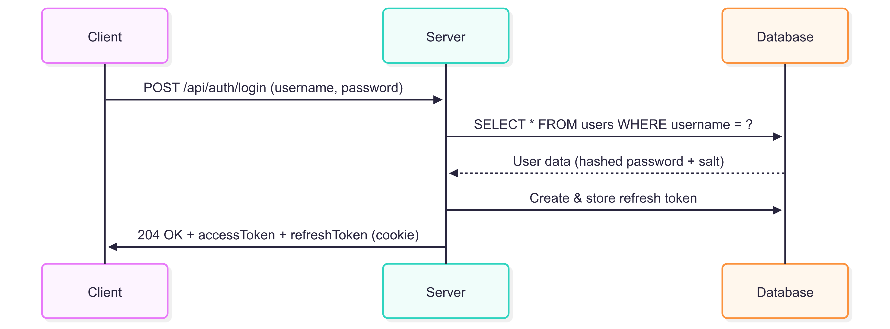

---

## 🔁 Access Token Yenileme Akışı

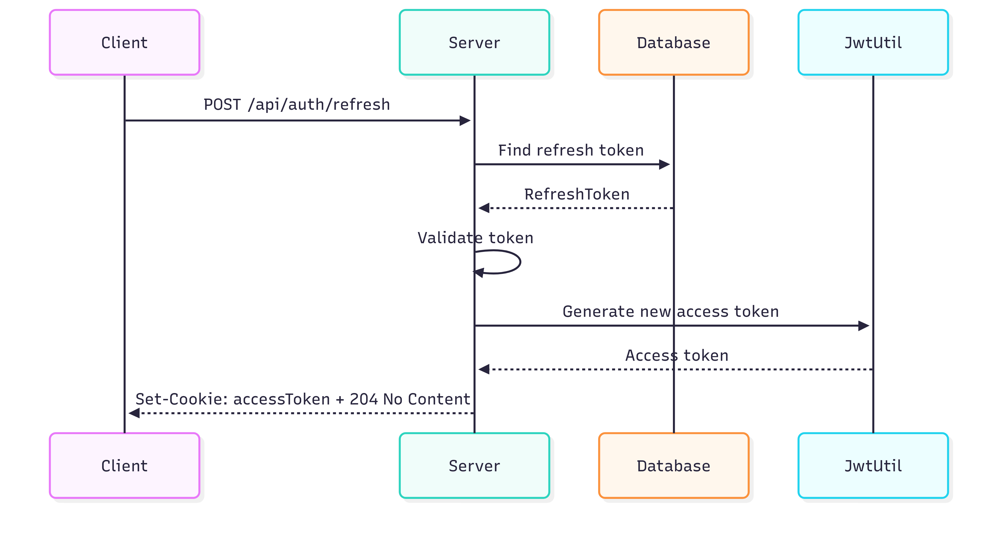

---

## 📊 Analyze API İşleyişi

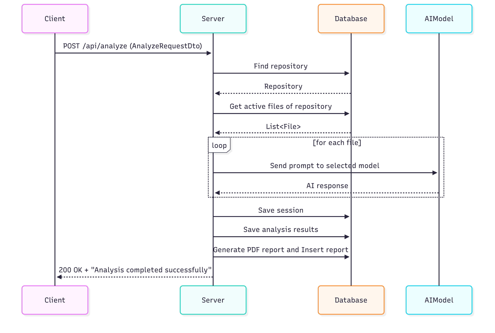

---

## 📥 Repository Import Akışı

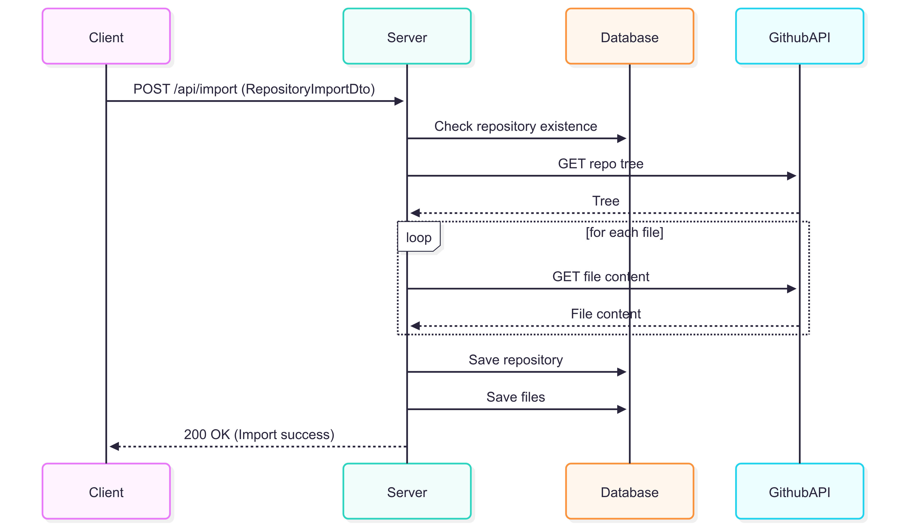

---

## 🔄 Repository Update Akışı

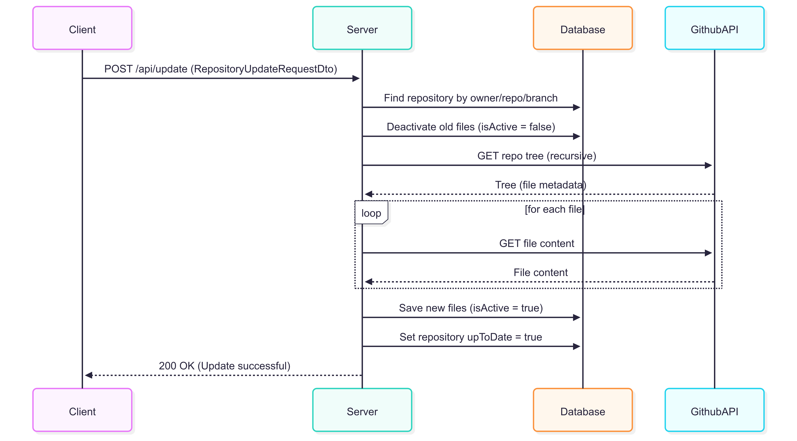

---

## 📦 Repository Değişiklik Kontrolü

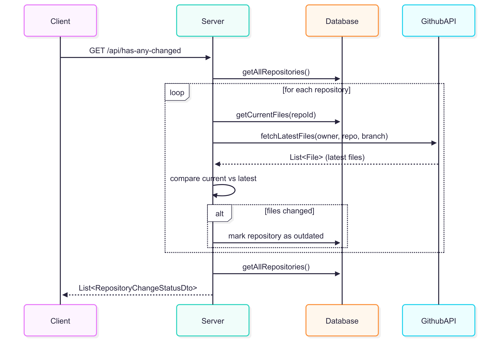

---

## 🔓 Logout Akışı

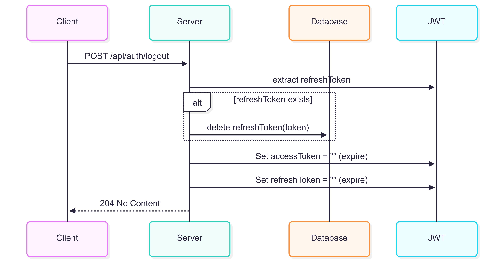


---